# Tax Gap Detection & Compliance Validation Service

Backend service for uploading financial transactions, validating transaction data, calculating expected tax, detecting tax gaps, executing compliance rules, recording audit events, and generating summary reports.

## Git Repository

Add the submitted repository URL here:

```text
https://github.com/<your-user>/<your-repository>
```

## Technology Stack

- Java 17
- Spring Boot 4.1.1
- Spring Web MVC
- Spring Security with HTTP Basic authentication
- Spring Data JPA / Hibernate
- PostgreSQL
- Flyway database migrations
- Maven
- JaCoCo test coverage report
- Springdoc OpenAPI / Swagger UI

## How To Run

Prerequisites:

- Java 17
- PostgreSQL
- Maven wrapper from this repository

Create the database:

```bash
createdb tax_compliance
```

Update DB credentials if needed in `src/main/resources/application.properties`:

```properties
spring.datasource.url=jdbc:postgresql://localhost:5432/tax_compliance
spring.datasource.username=postgres
spring.datasource.password=billing
```

Start the application:

```bash
./mvnw spring-boot:run
```

On Windows PowerShell:

```powershell
.\mvnw.cmd spring-boot:run
```

The app runs at:

```text
http://localhost:8090
```

Swagger UI:

```text
http://localhost:8090/swagger-ui.html
```

## Authentication

The application uses Spring Security with users stored in the `app_users` table. Flyway preloads these accounts:

| Username | Password | Role |
| --- | --- | --- |
| `admin` | `password` | `ADMIN` |
| `auditor` | `password` | `AUDITOR` |

All `/api/v1/**` endpoints require either `ADMIN` or `AUDITOR`.

## Database Setup

Flyway runs automatically at startup and creates all tables from `src/main/resources/db/migration`.

Main migrations:

- `V1`: transaction batch and financial transaction tables
- `V2`: tax calculation result table
- `V3`: compliance rules and exception records
- `V5`: audit logs
- `V6`: exception reporting indexes
- `V7`: application users
- `V8` to `V10`: default user password repair/upsert migrations

Hibernate is configured with:

```properties
spring.jpa.hibernate.ddl-auto=validate
```

That means Flyway owns schema creation and Hibernate validates entity/table compatibility.

## Database Schema Diagram

```mermaid
erDiagram
    TRANSACTION_BATCHES ||--o{ FINANCIAL_TRANSACTIONS : contains
    FINANCIAL_TRANSACTIONS ||--o| TAX_RESULT : has
    FINANCIAL_TRANSACTIONS ||--o{ EXCEPTION_RECORDS : triggers
    COMPLIANCE_RULES ||--o{ EXCEPTION_RECORDS : creates

    TRANSACTION_BATCHES {
        uuid id PK
        varchar batch_reference
        timestamptz uploaded_at
        int total_transactions
        int successful_transactions
        int failed_transactions
    }

    FINANCIAL_TRANSACTIONS {
        uuid id PK
        uuid batch_id FK
        varchar transaction_id
        date transaction_date
        varchar customer_id
        numeric amount
        numeric tax_rate
        numeric reported_tax
        varchar transaction_type
        varchar validation_status
        jsonb failure_reasons
        jsonb raw_transaction
        timestamptz created_at
    }

    TAX_RESULT {
        uuid id PK
        uuid transaction_id FK
        numeric expected_tax
        numeric tax_gap
        varchar compliance_status
        timestamptz calculated_at
    }

    COMPLIANCE_RULES {
        uuid id PK
        varchar rule_code
        varchar rule_name
        varchar rule_type
        boolean enabled
        jsonb configuration
        timestamptz created_at
        timestamptz updated_at
    }

    EXCEPTION_RECORDS {
        uuid id PK
        uuid transaction_id FK
        uuid rule_id FK
        varchar rule_code
        varchar rule_type
        varchar severity
        varchar message
        jsonb details
        timestamptz created_at
    }

    AUDIT_LOGS {
        uuid id PK
        varchar event_type
        varchar transaction_id
        timestamptz event_timestamp
        jsonb detail_json
    }

    APP_USERS {
        uuid id PK
        varchar username
        varchar password
        varchar role
        boolean enabled
    }
```



## Sample Transaction Upload JSON

```json
{
  "transactions": [
    {
      "transactionId": "TXN-1001",
      "date": "2026-09-01",
      "customerId": "CUST-001",
      "amount": 10000.00,
      "taxRate": 18.00,
      "reportedTax": 1800.00,
      "transactionType": "SALE"
    },
    {
      "transactionId": "TXN-1002",
      "date": "2026-09-02",
      "customerId": "CUST-002",
      "amount": 150000.00,
      "taxRate": 18.00,
      "reportedTax": 27000.00,
      "transactionType": "SALE"
    },
    {
      "transactionId": "TXN-1003",
      "date": "2026-09-03",
      "customerId": "CUST-001",
      "amount": 1500.00,
      "taxRate": 18.00,
      "reportedTax": 270.00,
      "transactionType": "REFUND",
      "originalTransactionId": "TXN-1001"
    }
  ]
}
```

## Sample Curl Calls

Health check:

```bash
curl http://localhost:8090/actuator/health
```

Upload transaction batch:

```bash
curl -u admin:password \
  -H "Content-Type: application/json" \
  -X POST http://localhost:8090/api/v1/transactions/batch \
  -d '{
    "transactions": [
      {
        "transactionId": "TXN-1001",
        "date": "2026-09-01",
        "customerId": "CUST-001",
        "amount": 10000.00,
        "taxRate": 18.00,
        "reportedTax": 1800.00,
        "transactionType": "SALE"
      }
    ]
  }'
```

Calculate tax for a batch:

```bash
curl -u admin:password \
  -X POST http://localhost:8090/api/v1/tax/calculate/batch/{batchId}
```

Execute compliance rules:

```bash
curl -u admin:password \
  -X POST http://localhost:8090/api/v1/compliance/rules/execute/batch/{batchId}
```

Customer tax summary report:

```bash
curl -u admin:password \
  http://localhost:8090/api/v1/reports/customers/tax-summary
```

Exception summary report:

```bash
curl -u admin:password \
  http://localhost:8090/api/v1/reports/exceptions/summary
```

Audit logs for a transaction:

```bash
curl -u admin:password \
  http://localhost:8090/api/v1/audit-logs/transaction/TXN-1001
```

Audit logs by event type:

```bash
curl -u admin:password \
  "http://localhost:8090/api/v1/audit-logs?eventType=TRANSACTION_UPLOADED"
```

## Reports

Implemented reports include:

- Customer tax summary: total amount, reported tax, expected tax, tax gap, and compliance score per customer.
- Exception summary: total exceptions, count by severity, and customer-wise exception counts.

The exception summary report uses repository aggregate queries (`COUNT`, `GROUP BY`) so the database performs aggregation instead of loading all exception rows into application memory.

## Test Coverage

Run tests and generate the JaCoCo report:

```bash
./mvnw test
```

Windows PowerShell:

```powershell
.\mvnw.cmd test
```

Open the coverage report:

```text
target/site/jacoco/index.html
```

Use this HTML report, or the IDE coverage view, for the required coverage screenshot.

## Design And Architecture

The service follows a layered Spring Boot architecture:

```text
Controller -> Service -> Repository -> Domain/Entity -> Database
```

Controllers expose REST endpoints and keep HTTP concerns at the boundary: request mapping, response status, request validation, and DTO contracts. They delegate business behavior to services and do not access repositories directly.

Services contain the main application logic. `TransactionService` validates and persists uploaded transaction batches. `TaxCalculationService` calculates expected tax and tax gap values. `ComplianceRuleEngineService` evaluates enabled rules from the database and creates exception records. `TaxReportService`, `ReportingService`, and `ExceptionSummaryReportService` produce read-only reports using database aggregation where appropriate. `AuditLogService` records and retrieves audit events for traceability.

Repositories are Spring Data JPA interfaces. They isolate persistence operations and custom JPQL queries from business logic. Reporting queries use projection interfaces such as `SeverityExceptionCount`, `CustomerExceptionCount`, and `CustomerTaxSummaryProjection` so only aggregated result data is returned to the service layer.

The domain model is represented by JPA entities under `entity`, including transaction batches, financial transactions, tax results, compliance rules, exception records, audit logs, and application users. Enums constrain business state such as transaction type, validation status, compliance status, rule type, and exception severity.

Security uses HTTP Basic authentication backed by the `app_users` database table. `DatabaseUserDetailsService` loads users from PostgreSQL, and `SecurityConfig` restricts API endpoints to users with `AUDITOR` or `ADMIN` roles. Public endpoints are limited to health/info and Swagger/OpenAPI documentation.

Database schema management is handled by Flyway migrations. Hibernate runs in `validate` mode so application startup fails if the entity model does not match the real database schema. This keeps schema changes explicit, reviewable, and repeatable across environments.
